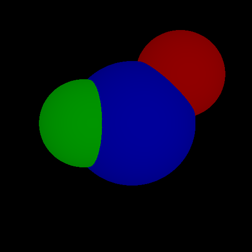

# Ray Marching Distance Field Demo

## Overview

This project is a small C++ demonstration of **ray marching over implicit distance fields**.
Rays are cast over a 2D grid, advanced through 3D space using distance estimates, and tested against simple geometric primitives. The resulting traversal data is visualized as a color-coded image.

The code serves as a **learning and experimentation project** for ray marching, signed distance functions, and basic rendering concepts.

## Features

* Grid-based ray generation
* Vector normalization and dot products
* Distance-field stepping (ray marching)
* Implicit sphere intersection tests
* Accumulated travel distance visualization
* Binary PPM image output

## Output

The program produces an image representing ray traversal and hit information.

* **File name**: `image.ppm`
* **Format**: Binary PPM (P6)
* **Resolution**: 512 × 512

Each color channel corresponds to a different object hit, with intensity based on normalized ray travel distance.

### Example Output



## Build

A C++20-compatible compiler is required.

Example using `g++`:

```bash
g++ -std=c++20 main.cpp -o ray_march
```

Ensure the following headers are available in the include path:

* `Ray.h`
* `Point.h`
* `Geometry.h`

## Run

```bash
./ray_march
```

After execution, the output image will be written to the current working directory.

## Project Structure

```
.
├── main.cpp
├── Ray.h
├── Point.h
├── Geometry.h
├── image.ppm   # generated output
└── README.md
```

## License

This project is open-source software.
See the `LICENSE` file for details.

